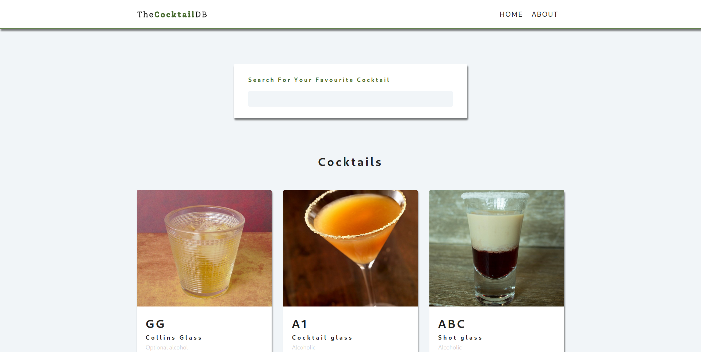
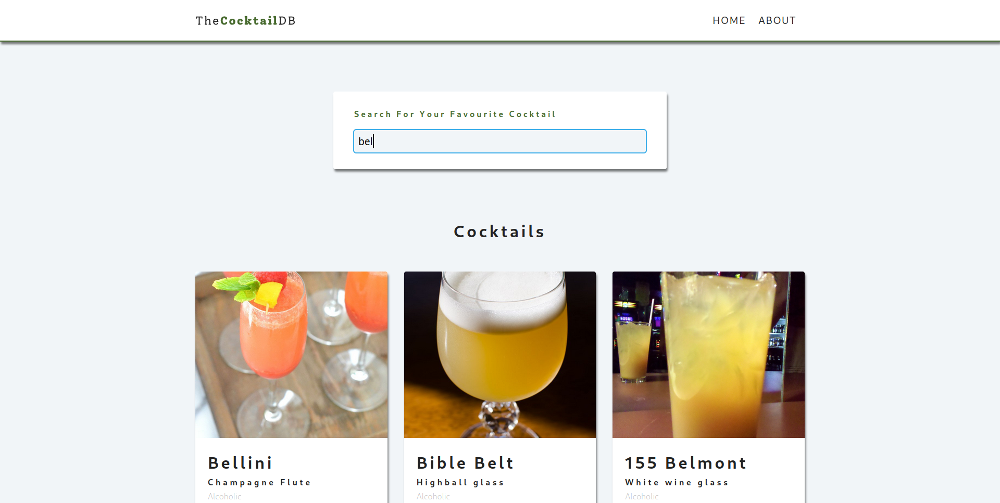

A simple application which displays different cocktails with the ability to search and to view the cocktails in greater detail.

This project is created with the aim of learning different aspects of ReactJS.

1. Displaying items using API
(./screenshots/display2.png)(./screenshots/display3.png)

2. Searching for Cocktails

